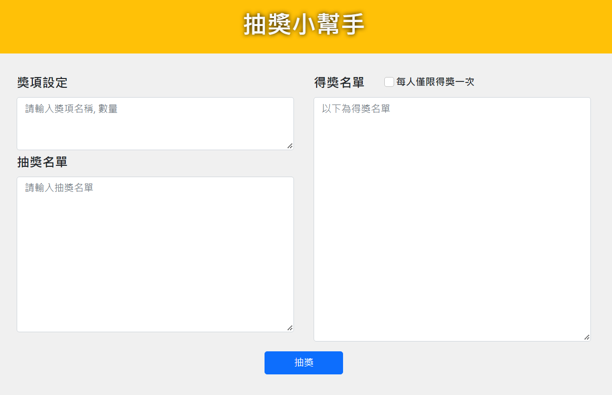

# 餐廳清單



## 介紹
此專案提供多個獎項抽獎功能

## 功能列表
- 使用者可以輸入獎項名稱、數量及抽獎名單，從名單中抽出得獎者
- 使用者可以限制得獎者不得重複中獎


# 使用方式
1. 確認安裝node.js 與 npm
2. 將此專案複製到本地
```
git clone
```
3. 透過終端機進入專案資料夾，執行以下指令安裝專案使用套件：
```
npm install
```
4. 執行啟動伺服器：
```
npm run start
```
5. 若終端機出現此行訊息代表伺服器順利運行，打開瀏覽器進入以下網址
```
Listening on http://localhost:3000
```
6. 若欲停止使用，請按：
```
ctrl + c
```

# 開發工具
- Node.js 16.14.2
- Express 4.18.1
- Express-Handlebars 3.0.0
- Bootstrap 5.1.3